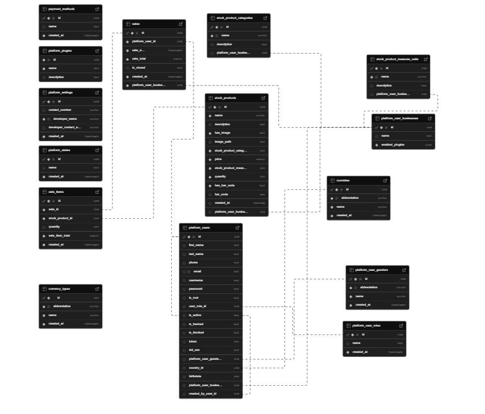

# Overview

This inventory management system is designed to efficiently track product quantities, restocking, and sales transactions. It integrates with Supabase, which is powered by AWS and PostgreSQL, to ensure data consistency, integrity, and scalability. The system provides the following core functionalities:

Product Management: Users can add, edit, and remove products. Each product entry includes details such as name, SKU, price, and quantity.

Stock Tracking: Inventory levels are automatically updated based on sales and restocking actions, preventing stock discrepancies.

Sales Recording: The system logs all sales transactions, capturing product details, quantities sold, timestamps, and relevant sales data.

User Roles: The application includes different access levels, such as admin, sales personnel, and stock managers, ensuring role-based permissions and security.

[Software Demo Video](https://youtu.be/Gq94EA1Ae54)

# Relational Database

The system utilizes a PostgreSQL relational database, managed through Supabase, to store and manage inventory data efficiently. The database schema includes the following key tables:

- Stock Products: Stores details of all inventory items, including id, name, description, price, quantity, category_id, measure_unit_id, and image_path.
- Stock Product Categories: Defines product categories, containing id, name, and description.
- Stock Product Measure Units: Stores unit measurements for products (e.g., liters, kilograms), with id, name, and description.
- Sales: Records all sales transactions with id, platform_user_id, sale_date, sale_total, and is_closed.
- Sale Items: Tracks individual products sold in a transaction, linking id, sale_id, stock_product_id, quantity, and sale_item_total.
- Users: Manages system users, including id, first_name, last_name, email, role_id, is_active, and authentication details.
- User Roles: Defines different roles in the system (id, name), managing access permissions.
- Platform User Businesses: Stores businesses registered in the system, linking users and products with id, name, and enabled_plugins.
- Currency Types: Maintains different currency types for transactions with id, abbreviation, and name.
- Payment Methods: Lists available payment methods with id, name, and created_at.
- Countries: Stores country information including id, name, and abbreviation.

# Development Environment

This software was developed using the following technologies:

- Next.js: For building the frontend and server-side rendering.
- PostgreSQL: As the relational database for storing inventory and sales data.
- Supabase: For managing authentication, real-time database updates, and API access.
- Node.js: For backend logic and API handling.

# Useful Websites

- [Next.js Documentation](https://nextjs.org/docs)
- [Supabase Documentation](https://supabase.com/docs)
- [PostgreSQL Documentation](https://www.postgresql.org/docs/)
- [MDN Web Docs](https://developer.mozilla.org/es/)
- [Stack Overflow](https://stackoverflow.com/questions)

# Future Work

- Add unit tests and integration tests for core functionalities.
- Enhance UI/UX for better usability and accessibility.
- Optimize database queries to improve performance.
- Implement reports and analytics for sales tracking.
- Add support for multiple warehouses or inventory locations.